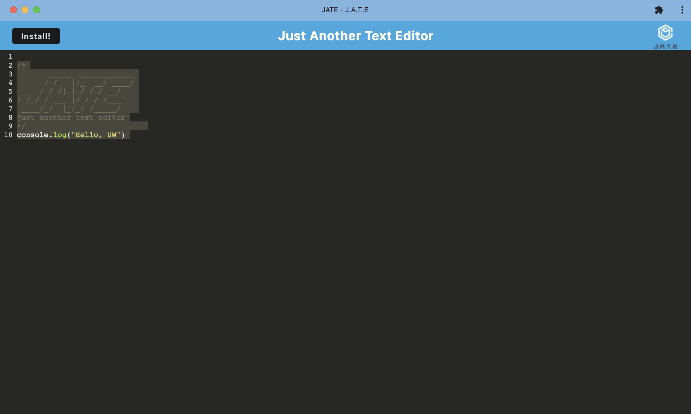
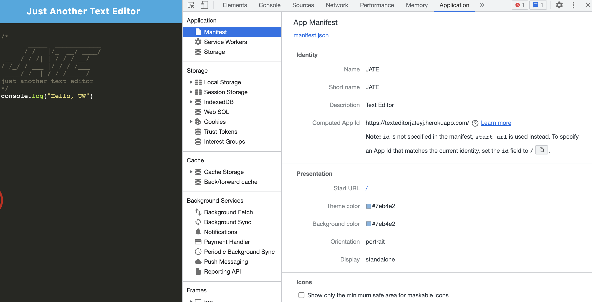
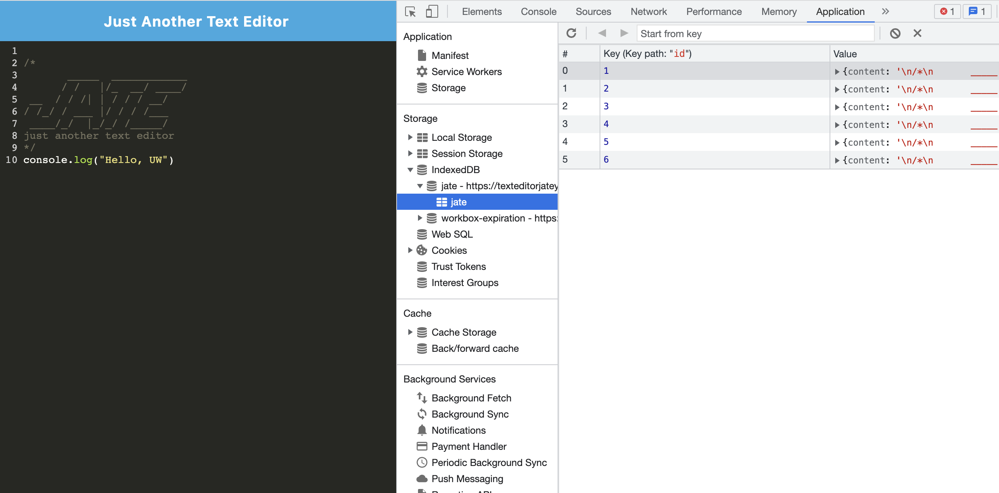

# Text-Editor

An text editor that runs in the browser, which meets the PWA criteria.

- The URL of the functional, deployed, mobile responsive application:
- https://texteditorjateyj.herokuapp.com/

## Table of Contents

- [Descripttion](#descripttion)
- [Installation](#installation)
- [Mock-Up](#mock-up)
- [Questions](#questions)

---

## Descripttion

The developers WANT to create notes or code snippets with or without an internet connection
SO THAT they can reliably retrieve them for later use

GIVEN a text editor web application
WHEN the developers open my application in my editor
THEN the developers should see a client server folder structure

WHEN the developers run `npm run start` from the root directory
THEN the developers find that my application should start up the backend and serve the client

WHEN the developers run the text editor application from my terminal
THEN the developers find that my JavaScript files have been bundled using webpack

WHEN the developers run my webpack plugins
THEN the developers find that the developers have a generated HTML file, service worker, and a manifest file

WHEN the developers use next-gen JavaScript in my application
THEN the developers find that the text editor still functions in the browser without errors

WHEN the developers open the text editor
THEN the developers find that IndexedDB has immediately created a database storage

WHEN the developers enter content and subsequently click off of the DOM window
THEN the developers find that the content in the text editor has been saved with IndexedDB

WHEN the developers reopen the text editor after closing it
THEN the developers find that the content in the text editor has been retrieved from our IndexedDB

WHEN the developers click on the Install button
THEN the developers download my web application as an icon on my desktop

WHEN the developers load my web application
THEN the developers should have a registered service worker using workbox

WHEN the developers register a service worker
THEN the developers should have my static assets pre cached upon loading along with subsequent pages and static assets

WHEN the developers deploy to Heroku
THEN the developers should have proper build scripts for a webpack application

---

## Installation

Storing data to an IndexedDB database. Use a package called `idb`, which is a lightweight wrapper around the IndexedDB API. It features a number of methods that are useful for storing and retrieving data, and is used by companies like Google and Mozilla.

---

## Mock-Up

The following images demonstrates the application functionality:

The following image shows the application's `manifest.json` file:

The following image shows the application's registered service worker:

The following image shows the application's IndexedDB storage:

---

## Questions

Feel free to reach out via Github or email with any questions.  
[Github](https://github.com/kayjinyi)  
[email](mailto:kayjinyi@gmail.com)

---
